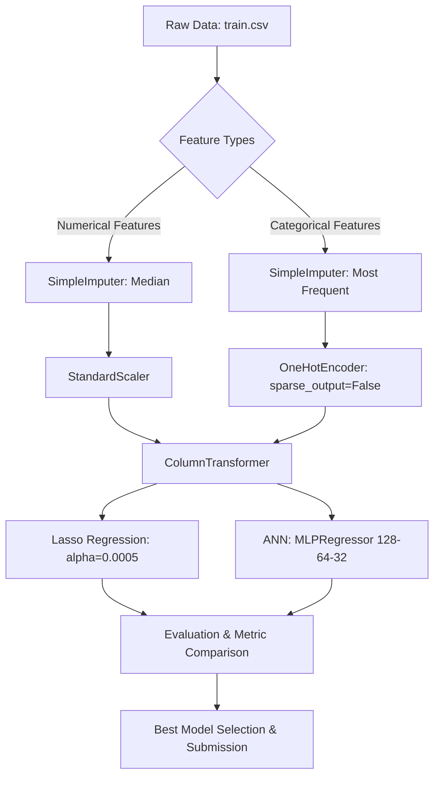

# House Prices Prediction using Advanced Regression & Neural Networks
### 5th Semester IT Engineering — Data Science Project

---

## 📌 Project Overview
This repository contains a complete, end-to-end Data Science project built in Python. The objective is to predict residential house sale prices in Ames, Iowa, using the Kaggle **House Prices: Advanced Regression Techniques** dataset. 

The project demonstrates key machine learning practices including:
- **Exploratory Data Analysis (EDA)** with statistical data visualizations.
- **Data Preprocessing & Cleaning Pipelines** using Scikit-Learn's `Pipeline` and `ColumnTransformer` with dense categorical encoding (`sparse_output=False`) to support both linear and deep neural network models.
- **Target Variable Transformation** using log scaling ($y = \log(1 + \text{SalePrice})$) to satisfy regression assumptions and stabilize variance.
- **Model Development & Comparison:**
  - **Lasso Regression (L1 Regularization):** A linear regularized model with embedded feature selection.
  - **Artificial Neural Network (ANN - MLPRegressor):** A 3-hidden-layer feedforward neural network (128 → 64 → 32 neurons) with ReLU activation and Adam optimizer.
- **Model Evaluation:** Standardized evaluation using Log-RMSE (Kaggle metric), Root Mean Squared Error in dollars ($ USD), and Coefficient of Determination ($R^2$).
- **Model Persistence & Deployment:** Saving the trained pipelines (`best_house_price_model.pkl`, `ann_house_price_model.pkl`) and generating predictions for the Kaggle test set (`submission.csv`).

---

## 📂 Project Structure
```text
House price regression/
│
├── data/
│   ├── train.csv                      # Training dataset (1,460 rows, includes SalePrice)
│   └── test.csv                       # Testing dataset (1,459 rows, predict SalePrice)
│
├── House_Prices_Prediction.ipynb      # Main Jupyter Notebook with all outputs & plots
├── generate_notebook.py               # Script used to generate the notebook skeleton
├── best_house_price_model.pkl         # Serialized best model pipeline (Lasso)
├── ann_house_price_model.pkl          # Serialized ANN model pipeline (MLPRegressor)
├── submission.csv                     # Predicted SalePrice for test data (Kaggle format)
└── README.md                          # Project documentation (this file)
```

---

## 📊 Dataset Description
The dataset represents the Ames Housing dataset describing residential home sales. It contains **79 explanatory variables** focusing on:
- **Location & Zoning:** MSZoning, Neighborhood, Condition.
- **Lot & Space:** LotFrontage, LotArea, GrLivArea.
- **Quality & Condition:** OverallQual, OverallCond, YearBuilt.
- **Utilities & Features:** Heating, CentralAir, GarageCars, PoolArea.
- **Target Variable:** `SalePrice` — the property's sale price in dollars.

---

## 💻 Prerequisites & Installation

### 1. Requirements
Ensure you have **Python 3.12+** installed on your system.

### 2. Installation Steps
Clone or open the workspace folder and run the following commands in your shell to set up an isolated Python virtual environment and install the required packages:

```bash
# 1. Create a virtual environment
python -m venv .venv

# 2. Activate the virtual environment
# On Windows:
.venv\Scripts\activate
# On macOS/Linux:
source .venv/bin/activate

# 3. Install core dependencies
pip install pandas numpy matplotlib seaborn scikit-learn notebook
```

---

## ⚙️ Workflow & Pipeline Architecture

The machine learning workflow is structured within Scikit-Learn's **Pipeline** and **ColumnTransformer** architecture:



1. **Separation of Roles:** Preprocessing is divided into separate pipelines for numerical columns (Median Imputation + Standard Scaling) and categorical columns (Most Frequent Imputation + Dense One-Hot Encoding).
2. **Dense Array Compatibility:** `sparse_output=False` is set in `OneHotEncoder` so both Lasso and `MLPRegressor` receive compatible dense inputs.
3. **Target Scaling:** `np.log1p()` is applied to `SalePrice` during training. Predictions are mapped back to dollar scale using `np.expm1()`.
4. **Data Leakage Prevention:** Preprocessors are fitted strictly on the training partition and applied identically to the validation and test partitions.

---

## 🧠 Algorithms Explained

### 1. Lasso Regression (L1 Regularization)
Lasso (Least Absolute Shrinkage and Selection Operator) adds an L1 regularization penalty proportional to the absolute values of the regression coefficients to the loss function:

$$\text{Loss} = \sum_{i=1}^n (y_i - \hat{y}_i)^2 + \alpha \sum_{j=1}^p |w_j|$$

- **Feature Selection:** Due to the sharp geometric corners of the L1 diamond constraint, Lasso drives less important feature weights to exactly zero ($w_j = 0$).
- **High-Dimensional Data Advantage:** After one-hot encoding categorical features, the dataset expands to ~288 columns. Lasso eliminates redundant and noisy features, reducing variance and preventing overfitting on small-to-medium tabular datasets.

---

### 2. Artificial Neural Network (ANN — MLPRegressor)
The Artificial Neural Network is implemented using Scikit-Learn's `MLPRegressor` (Multi-Layer Perceptron for continuous regression).

#### Neural Network Architecture:
```text
  Input Features (~288 Encoded & Scaled Inputs)
                     ↓
  Hidden Layer 1 (128 neurons, ReLU activation)
                     ↓
  Hidden Layer 2 (64 neurons, ReLU activation)
                     ↓
  Hidden Layer 3 (32 neurons, ReLU activation)
                     ↓
  Output Layer   (1 continuous neuron for log-price)
```

- **Hidden Layers & Neurons:** Three fully connected layers (`hidden_layer_sizes=(128, 64, 32)`) progressively compress high-dimensional representations into abstract feature representations.
- **ReLU Activation Function ($f(x) = \max(0, x)$):** Introduces non-linearity, allowing the network to capture complex, non-linear interactions between house characteristics (e.g., interaction between neighborhood and overall quality).
- **Adam Optimizer (`solver='adam'`, `learning_rate_init=0.001`):** An adaptive gradient descent optimizer that dynamically computes individual learning rates for different parameters.
- **Early Stopping (`early_stopping=True`, `validation_fraction=0.1`):** Automatically halts training if the validation loss does not improve over successive epochs, guarding against overfitting.

---

## 📈 Model Performance & Evaluation

Both models were trained and evaluated on an identical 80/20 train-validation split (`random_state=42`).

### Evaluation Results Table:

| Model | Log-RMSE (Kaggle Metric) | Validation RMSE ($ USD) | $R^2$ Score (Log-Scale) |
| :--- | :---: | :---: | :---: |
| **Lasso Regression** | **0.12781** | **$22,588.34** | **91.25%** |
| **Artificial Neural Network (ANN)** | 0.17424 | $31,541.55 | 83.73% |

- **Primary Metric:** Log-RMSE (lower is better)
- **Best Model:** **Lasso Regression** (Log-RMSE: `0.12781`, $R^2$: `91.25%`)

---

## 🎓 Final Academic Conclusion

> "We compared Lasso Regression and an Artificial Neural Network for house price prediction using the Ames Housing Dataset. Both models used the same training and validation data and comparable preprocessing. The models were evaluated using Log-RMSE, RMSE, and R². Based on the validation results, **Lasso Regression** performed better than the **Artificial Neural Network**. The results show that **Lasso achieved a lower Log-RMSE of 0.12781 (vs. 0.17424 for ANN) and a higher $R^2$ score of 91.25% (vs. 83.73% for ANN), demonstrating that L1 feature selection is more effective and sample-efficient than deep neural networks on small-to-medium tabular datasets**."

---

## 🚀 How to Run the Project

1. Activate your virtual environment:
   ```bash
   .venv\Scripts\activate
   ```
2. Start Jupyter Notebook:
   ```bash
   jupyter notebook
   ```
3. Open `House_Prices_Prediction.ipynb` in your browser.
4. Run all cells sequentially (`Cell` -> `Run All`).
5. The notebook will automatically generate:
   - `best_house_price_model.pkl` (Saved best pipeline — Lasso)
   - `ann_house_price_model.pkl` (Saved ANN pipeline)
   - `submission.csv` (Predictions file ready for Kaggle submission)
