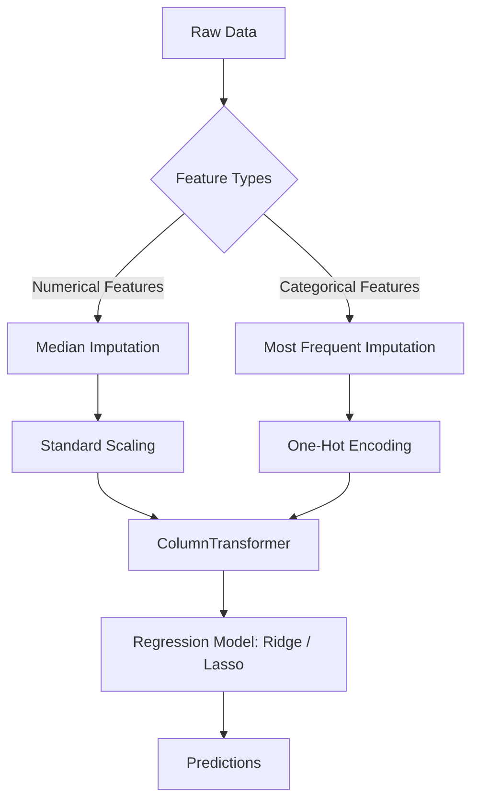

# House Prices Prediction using Advanced Regression Techniques
### 5th Semester IT Engineering — Data Science Project

---

## 📌 Project Overview
This repository contains a complete, end-to-end Data Science project built in Python. The objective is to predict residential house sale prices in Ames, Iowa, using the popular Kaggle **House Prices: Advanced Regression Techniques** dataset. 

The project demonstrates key machine learning practices including:
- **Exploratory Data Analysis (EDA)** with data visualizations.
- **Data Preprocessing & Cleaning Pipelines** using Scikit-Learn's `Pipeline` and `ColumnTransformer`.
- **Target Variable Transformation** using log scaling to satisfy linear regression assumptions.
- **Regularized Regression Modeling** comparing **Ridge (L2)** and **Lasso (L1)** regression models.
- **Model Evaluation** using Root Mean Squared Error (RMSE) and Coefficient of Determination ($R^2$ Score).
- **Model Persistence** saving the final trained model in serialization format (`.pkl`).

---

## 📂 Project Structure
```text
House price regression/
│
├── data/
│   ├── train.csv                      # Training dataset (includes SalePrice)
│   └── test.csv                       # Testing dataset (predict SalePrice)
│
├── House_Prices_Prediction.ipynb      # Main project Jupyter Notebook
├── generate_notebook.py               # Script used to generate the notebook skeleton
├── best_house_price_model.pkl         # Serialized best-performing model pipeline
├── submission.csv                     # Predicted SalePrice for test data (Kaggle format)
└── README.md                          # Project documentation (this file)
```

---

## 📊 Dataset Description
The dataset represents the Ames Housing dataset describing residential home sales. It contains **79 explanatory variables** (features) focusing on:
- **Location & Zoning:** MSZoning, Neighborhood, Condition.
- **Lot & Space:** LotFrontage, LotArea, GrLivArea.
- **Quality & Condition:** OverallQual, OverallCond, YearBuilt.
- **Utilities & Features:** Heating, CentralAir, GarageCars, PoolArea.
- **Target Variable:** `SalePrice` — the property's sale price in dollars.

---

## 💻 Prerequisites & Installation

### 1. Requirements
Ensure you have **Python 3.12+** installed on your system.

### 2. Installation Steps
Clone or open the workspace folder and run the following commands in your shell to set up an isolated Python virtual environment and install the required packages:

```bash
# 1. Create a virtual environment
python -m venv .venv

# 2. Activate the virtual environment
# On Windows:
.venv\Scripts\activate
# On macOS/Linux:
source .venv/bin/activate

# 3. Install core dependencies
pip install pandas numpy matplotlib seaborn scikit-learn notebook
```

---

## ⚙️ Workflow & Pipeline Architecture

The machine learning workflow is structured within Scikit-Learn's robust **Pipeline** architecture:



1. **Separation of Roles:** Preprocessing is divided into separate pipelines for numerical columns (Median Imputation + Standard Scaling) and categorical columns (Most Frequent Imputation + One-Hot Encoding).
2. **Encapsulation:** Preprocessing pipelines and regression models are combined using `Pipeline` and `ColumnTransformer` to prevent data leakage during train-validation splits.
3. **Target Scaling:** `np.log1p()` is applied to the target `SalePrice` during training to normalize its distribution. Final evaluation and predictions are reverted to the original dollar scale using `np.expm1()`.

---

## 🧠 Algorithms Explained (For Project Viva)

### 1. Ridge Regression (L2 Regularization)
Ridge Regression addresses the issue of multicollinearity (high correlation between independent variables) in linear regression. It adds an L2 regularization penalty to the loss function:
$$\text{Loss} = \sum_{i=1}^n (y_i - \hat{y}_i)^2 + \alpha \sum_{j=1}^p w_j^2$$
- **Mechanism:** Shrinks the regression coefficients ($w_j$) close to zero but never forces them to exactly zero.
- **Alpha ($\alpha$):** Tuning parameter that controls penalty strength. Larger $\alpha$ values increase regularization, reducing model variance but increasing bias.

### 2. Lasso Regression (L1 Regularization)
Lasso (Least Absolute Shrinkage and Selection Operator) Regression adds an L1 regularization penalty to the loss function:
$$\text{Loss} = \sum_{i=1}^n (y_i - \hat{y}_i)^2 + \alpha \sum_{j=1}^p |w_j|$$
- **Mechanism:** Performs automatic **feature selection** by forcing some coefficient weights to exactly zero. Features with zero weights are effectively removed from the model.
- **Benefit:** Highly useful when dealing with high-dimensional data (e.g., after one-hot encoding), producing a simpler and more interpretable model.

---

## 📈 Model Performance & Evaluation
After running the notebook, the models are evaluated on a 20% validation split. The results summary is:

| Model | Log-RMSE (Kaggle Metric) | Validation RMSE ($ USD) | $R^2$ Score (Log-Scale) |
|---|---|---|---|
| **Ridge Regression** | 0.13611 | $25,053.84 | 90.07% |
| **Lasso Regression** | **0.12781** | **$22,588.34** | **91.25%** |

*(Note: Actual values may slightly vary depending on train-test splits and library versions. Lasso Regression generally performs slightly better due to its sparse feature selection capabilities.)*

---

## 🚀 How to Run the Project
1. Activate your virtual environment:
   ```bash
   .venv\Scripts\activate
   ```
2. Start Jupyter Notebook:
   ```bash
   jupyter notebook
   ```
3. Open `House_Prices_Prediction.ipynb` in the browser interface.
4. Run all cells sequentially from top to bottom (`Cell` -> `Run All`).
5. After execution, the notebook will generate:
   - `best_house_price_model.pkl` (Saved model)
   - `submission.csv` (Predictions file ready for Kaggle submission)
